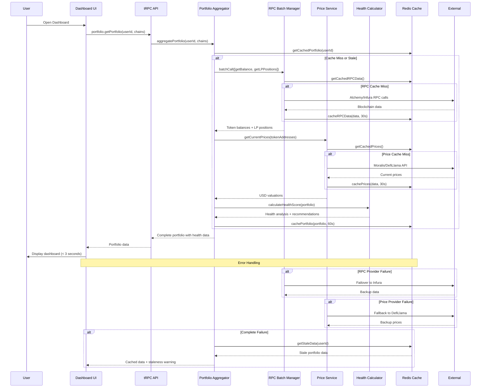
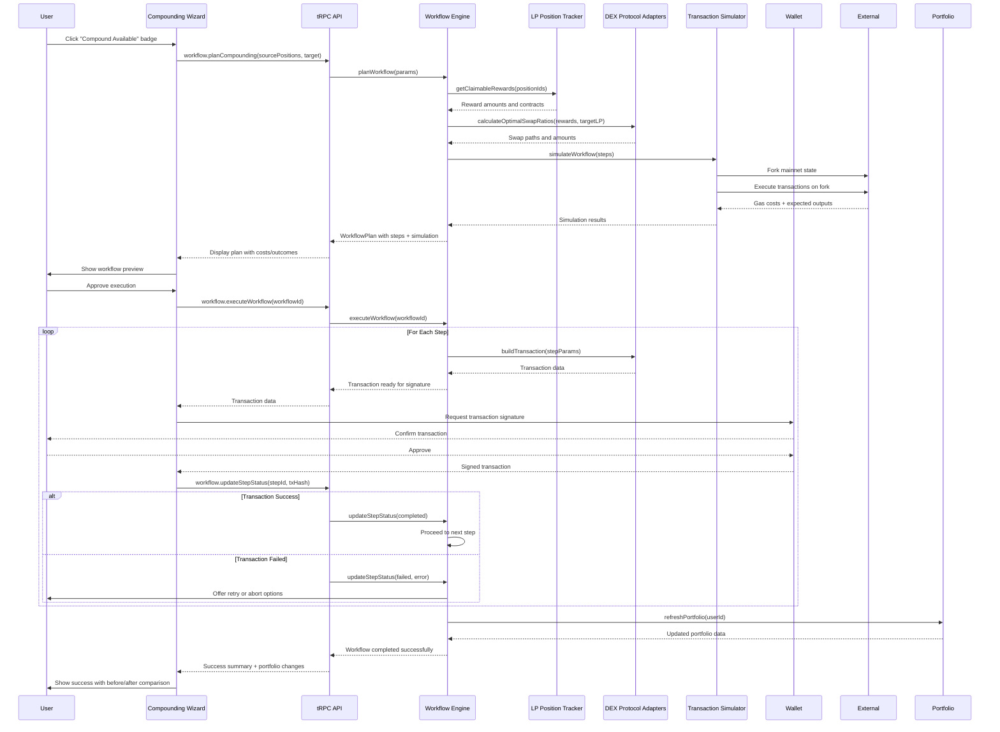

# Core Workflows

I'll illustrate the key system workflows using sequence diagrams to show component interactions, including both high-level user journeys and detailed technical flows with error handling paths.

## Portfolio Overview and Health Assessment Flow

## Cross-LP Compounding Workflow (Core Differentiator)

