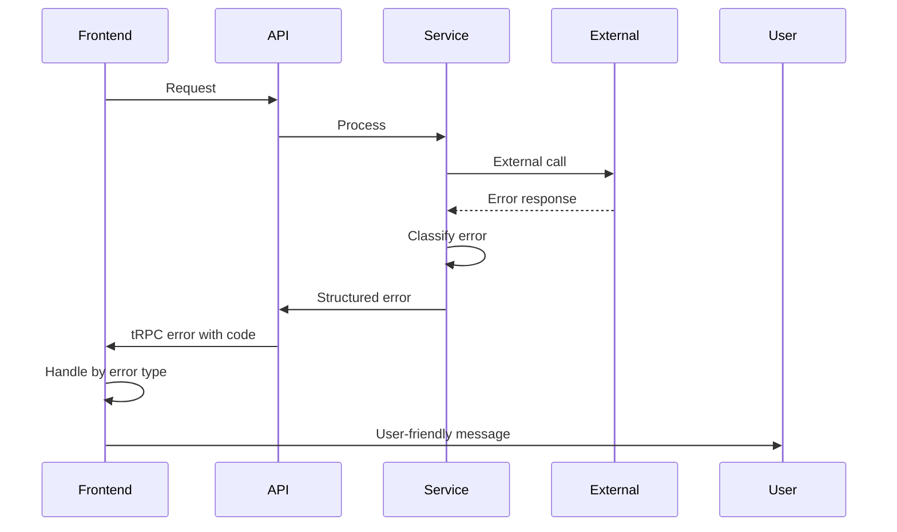

# Error Handling Strategy

## Error Flow



## Error Response Format

```typescript
interface ApiError {
  error: {
    code: string;
    message: string;
    details?: Record<string, any>;
    timestamp: string;
    requestId: string;
  };
}
```

## Frontend Error Handling

```typescript
// Global error boundary for unhandled errors
export function GlobalErrorBoundary({ children }: { children: React.ReactNode }) {
  return (
    <ErrorBoundary
      fallback={<ErrorFallback />}
      onError={(error, errorInfo) => {
        console.error('Global error:', error, errorInfo);
        // Send to monitoring service
      }}
    >
      {children}
    </ErrorBoundary>
  );
}

// tRPC error handling
const portfolioQuery = trpc.portfolio.getPortfolio.useQuery(
  { userId },
  {
    onError: (error) => {
      if (error.data?.code === 'RPC_ERROR') {
        toast.error('Blockchain connection issue. Retrying...');
      } else if (error.data?.code === 'RATE_LIMIT_EXCEEDED') {
        toast.error('Too many requests. Please wait a moment.');
      } else {
        toast.error('Failed to load portfolio. Please try again.');
      }
    }
  }
);
```

## Backend Error Handling

```typescript
// Standardized error classes
export class DeFiError extends TRPCError {
  constructor(
    code: 'RPC_ERROR' | 'WORKFLOW_FAILED' | 'INSUFFICIENT_BALANCE',
    message: string,
    details?: Record<string, any>
  ) {
    super({
      code: 'BAD_REQUEST',
      message,
      cause: { code, details }
    });
  }
}

// Global error handler middleware
export const errorHandler = (
  error: Error,
  request: FastifyRequest,
  reply: FastifyReply
) => {
  const errorId = uuid();
  
  server.log.error({
    errorId,
    error: error.message,
    stack: error.stack,
    url: request.url,
    method: request.method,
    userId: request.user?.id
  });

  if (error instanceof DeFiError) {
    reply.code(400).send({
      error: {
        code: error.cause.code,
        message: error.message,
        details: error.cause.details,
        timestamp: new Date().toISOString(),
        requestId: errorId
      }
    });
  } else {
    reply.code(500).send({
      error: {
        code: 'INTERNAL_SERVER_ERROR',
        message: 'An unexpected error occurred',
        timestamp: new Date().toISOString(),
        requestId: errorId
      }
    });
  }
};
```
