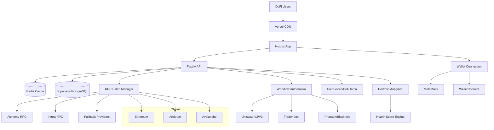

# High Level Architecture

## Technical Summary

JarrBank employs a **Jamstack serverless architecture** with Next.js 15 frontend and Fastify API backend, deployed on Vercel with Railway for backend services. The system integrates deeply with Web3 infrastructure through a sophisticated **batched RPC architecture** that minimizes rate limiting while maintaining sub-10-second portfolio refresh times across multiple chains. Core differentiation comes from the **workflow automation engine** that orchestrates complex cross-protocol DeFi operations, transforming manual 3-hour weekly maintenance into streamlined 45-minute experiences. The architecture prioritizes **developer velocity** through monorepo structure and shared TypeScript interfaces while maintaining production-grade performance through Redis caching, intelligent data prefetching, and progressive loading strategies.

## Platform and Infrastructure Choice

**Platform:** Vercel + Railway + Supabase  
**Key Services:** Vercel (frontend hosting), Railway (API hosting), Supabase (PostgreSQL + Auth), Redis Cloud (caching)  
**Deployment Host and Regions:** Primary: us-east-1, Secondary: eu-west-1 for global accessibility

**Rationale:** Best balance of development velocity and production readiness. Vercel's Next.js optimizations align with the 3-second dashboard load requirement, Railway provides excellent backend service management, and Supabase offers managed PostgreSQL with real-time features that could enhance portfolio updates.

## Repository Structure

**Structure:** Turborepo monorepo with package-based organization  
**Monorepo Tool:** Turborepo (optimized for Next.js ecosystem)  
**Package Organization:** Feature-based packages with clear dependency boundaries

**Rationale:** Turborepo provides excellent caching and parallel execution for the rapid iteration needs while maintaining simple configuration. The package structure supports atomic commits across full-stack changes critical for Web3 feature development where frontend and backend must stay synchronized.

## High Level Architecture Diagram

## Architectural Patterns

- **Jamstack Architecture:** Static site generation with serverless APIs - _Rationale:_ Optimal performance and global CDN distribution for dashboard loading under 3 seconds
- **Component-Based UI:** Reusable React components with TypeScript - _Rationale:_ Maintainability and type safety across large DeFi-specific UI components
- **Repository Pattern:** Abstract data access logic - _Rationale:_ Enables testing and future database migration flexibility for evolving DeFi data requirements
- **API Gateway Pattern:** Single Fastify API entry point - _Rationale:_ Centralized auth, rate limiting, and monitoring for Web3 operations
- **Event-Driven Workflow:** Async workflow orchestration - _Rationale:_ Handles complex multi-step DeFi operations with proper error recovery
- **Cache-First Data:** Redis-backed caching with TTL - _Rationale:_ Reduces RPC calls while maintaining data freshness for portfolio updates
- **Circuit Breaker:** RPC failover and retry logic - _Rationale:_ Ensures system reliability despite Web3 infrastructure instability
