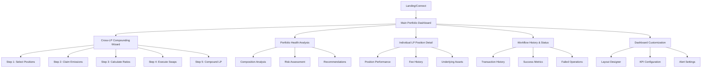

# Information Architecture (IA)

## Site Map / Screen Inventory

## Navigation Structure

**Primary Navigation:** Single-level horizontal navigation with dashboard as the hub. No traditional multi-level navigation - instead, contextual panels and modals branch from the main dashboard to maintain focus and reduce cognitive load.

**Secondary Navigation:** Context-sensitive action panels that appear within dashboard sections. For example, LP positions show inline actions like "View Details," "Compound," or "Claim Rewards" without leaving the main view.

**Breadcrumb Strategy:** Minimal breadcrumb usage due to dashboard-centric model. Only used within multi-step workflows (Cross-LP Compounding Wizard) to show progress: "Dashboard > Compounding > Step 2: Claim Emissions"
