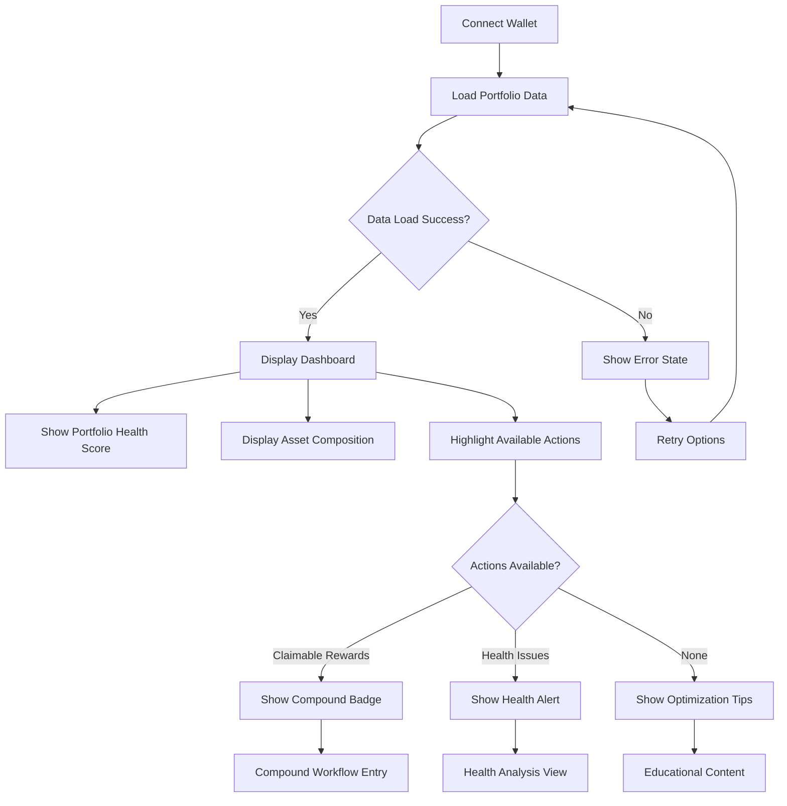
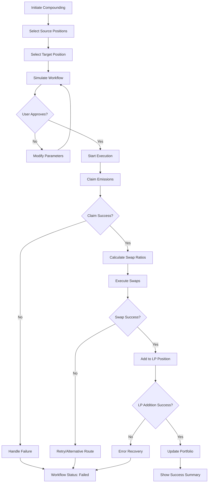

# User Flows

## Portfolio Overview Flow

**User Goal:** Quickly assess portfolio health and identify optimization opportunities

**Entry Points:** 
- Direct dashboard access after wallet connection
- Refresh button for updated data
- Mobile app launch

**Success Criteria:** 
- Portfolio health visible within 10 seconds
- Actionable opportunities clearly highlighted
- Context-aware recommendations displayed

### Flow Diagram

### Edge Cases & Error Handling:
- RPC connection failures → Graceful fallback with retry mechanisms
- Partial data loading → Progressive display with loading skeletons
- Zero balances → "Get Started" guidance instead of empty state
- Network switching → Automatic refresh with loading indicator
- Wallet disconnection → Secure session cleanup with reconnect prompt

**Notes:** This flow prioritizes immediate value display over comprehensive data loading, aligning with the "glanceable intelligence" principle.

## Cross-LP Compounding Workflow Flow

**User Goal:** Automate claiming, swapping, and compounding across multiple LP positions to maximize yield

**Entry Points:**
- "Compound Available" badge from dashboard
- Scheduled automation trigger
- Manual workflow initiation

**Success Criteria:**
- Multi-step process completed with 85% success rate (per NFR5)
- Clear progress indication at each step
- Transaction simulation before execution

### Flow Diagram

### Edge Cases & Error Handling:
- Gas price spikes during execution → Dynamic gas adjustment with user approval
- Slippage exceeding tolerance → Transaction rejection with ratio recalculation
- Protocol maintenance/downtime → Alternative protocol routing suggestions
- Partial workflow completion → Resume from failed step capability
- Network congestion → Queue management with estimated completion times

**Notes:** The workflow includes comprehensive simulation and validation steps to achieve the 85% success rate requirement while maintaining user control at critical decision points.
